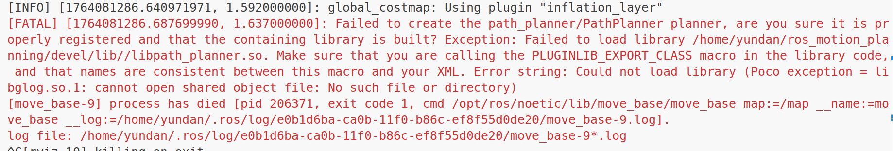

# 常见错误

- build（构建）过程错误参见[#48](https://github.com/ai-winter/ros_motion_planning/issues/48)，重点在于应该使用作者的安装脚本即`./script/build.sh`而不是`catkin_make`
- 运行过程错误：
  - 错误 1：
    解决方法：
  ```shell
  sudo ln -s /usr/lib/x86_64-linux-gnu/libglog.so.0 /usr/lib/x86_64-linux-gnu/libglog.so.1
  sudo ldconfig
  ```
  - 错误 2：
    
    解决方法参见[#114](https://github.com/ai-winter/ros_motion_planning/issues/114#issuecomment-3231213979)
